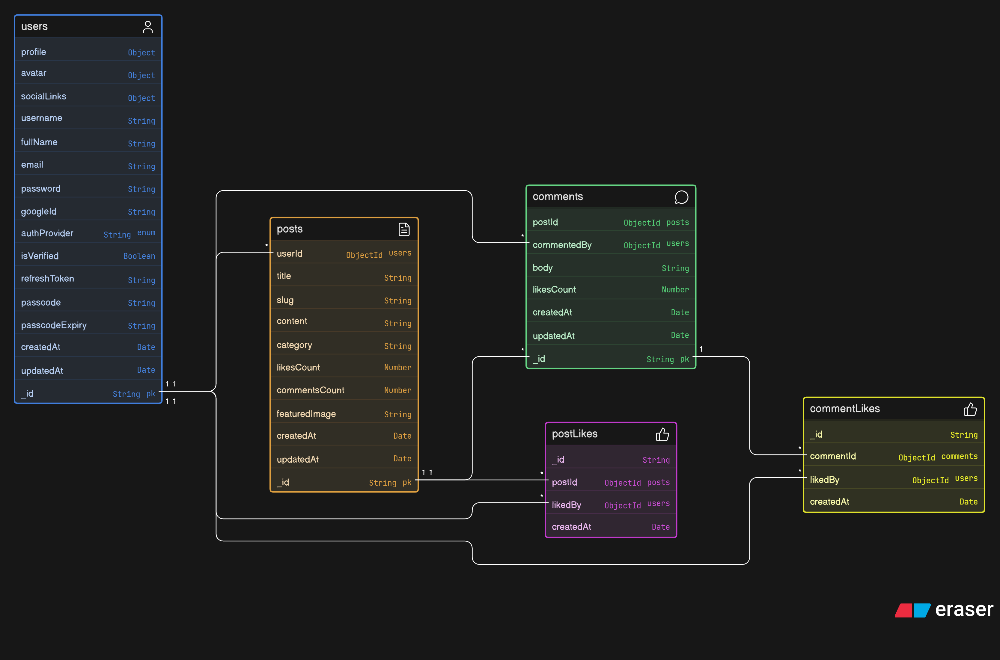
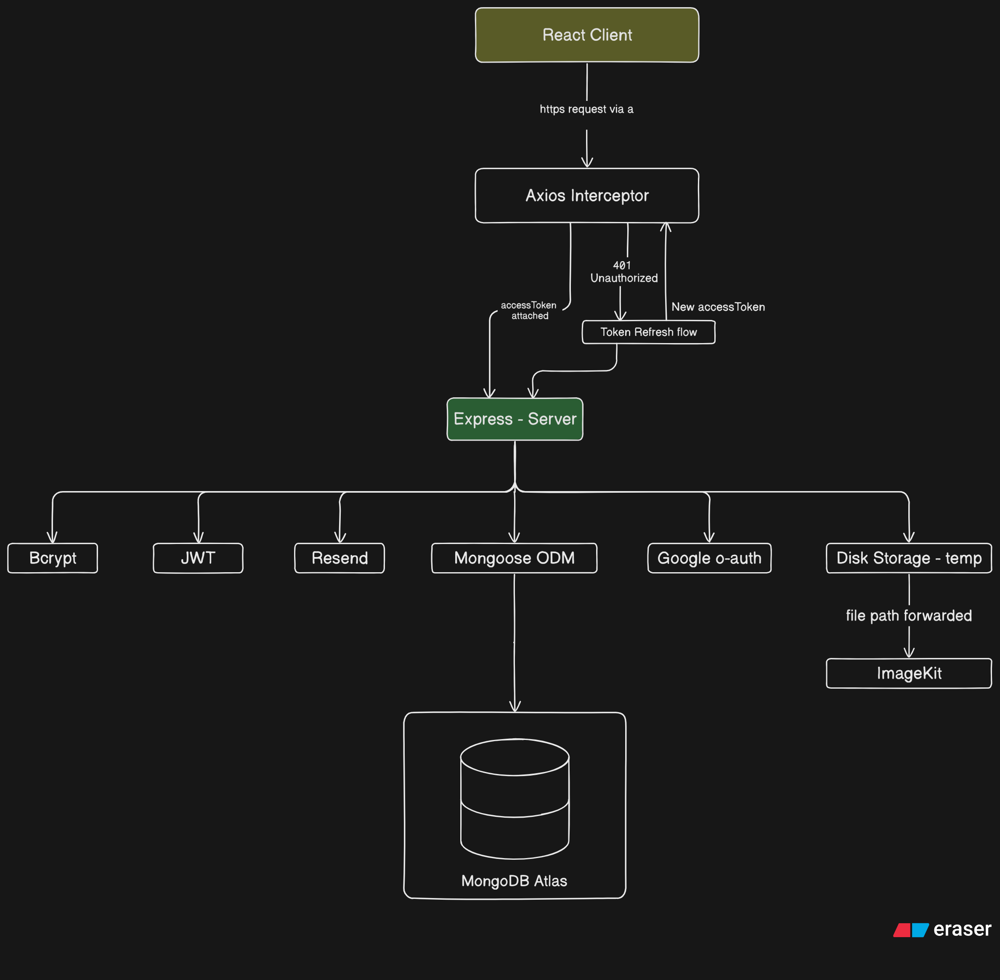

# [WRITTES](https://writtes.com)

### An article writting and sharing web platform with secured authentication

## Table of Contents

- [About](#-about)
- [Tech Stack](#-tech-stack)
- [Database Design](#-database-design)
- [System Architecture](#-system-architecture)
- [Features](#-features)
- [Authentication Flow](#-authentication-flow)
- [Token Refresh Interceptor](#-token-refresh-interceptor-axios)
- [File Upload Pipeline](#-file-upload-pipeline-multer--imagekit)
- [MongoDB Aggregation Pipeline](#-mongodb-aggregation-pipeline)
- [Project Structure](#-project-structure)
- [Roadmap](#-roadmap)

## About

WRITTES is a full-stack blog writing and sharing web platform currently in development with a focus on security and developer-grade architecture. It features a JWT-based token rotation authentication system, cloud-based media management via ImageKit, a rich text editor powered by Lexical which is currently in development, and a MongoDB aggregation-driven post feed.

> Source code is private. This repository documents the architecture, design decisions, and system flows.

## Tech Stack

### Frontend

- React JS
- Redux Toolkit
- Ant Design
- Lexical Rich Text Editor
- Axios
- React Hook Form (RHF)

### Backend

- Express JS
- Bcrypt
- Json Web Token
- Mongoose ODM
- Multer JS
- Resend Mail Service

### Database

- MongoDB Atlas
- ImageKit (File & Media Uploads)

### Deployment

- Docker
- Nginx
- DigitalOcean Droplet

## DataBase Design

### ER - Diagram

###

## System Architecture Diagram

## Features

### Current V-1 Working Features

### Authentication System

- Register & Login with JWT Access & Refresh Token rotation system
- OTP-based email verification on registration
- Forgot Password via OTP email flow
- Google OAuth 2.0 login & registration integration
- Bcrypt password hashing
- Secure httpOnly cookie based refresh token storage

### User Features

- Avatar upload via Multer to ImageKit pipeline
- Profile update — bio, about, social links
- User public profile page (as author)

### Posts & Feed

- Read blog posts uploaded for demo use case
- Like / Unlike posts
- User liked posts list
- Paginated blog post feed with configurable page size in browser URL
- Paginated search results
- Post aggregation with author info & like status in a single DB query
