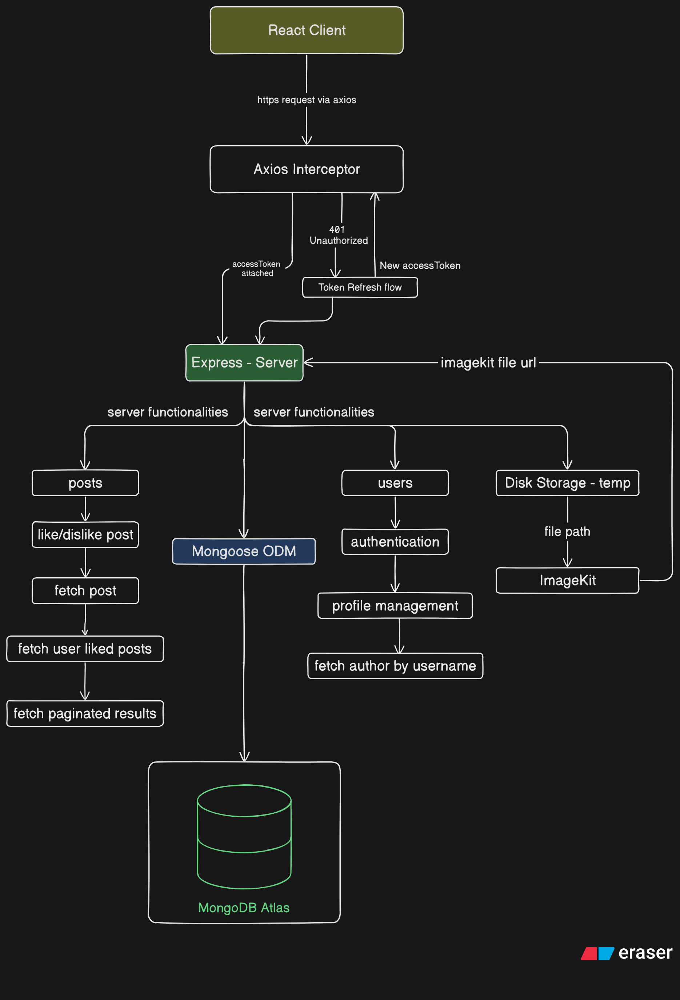
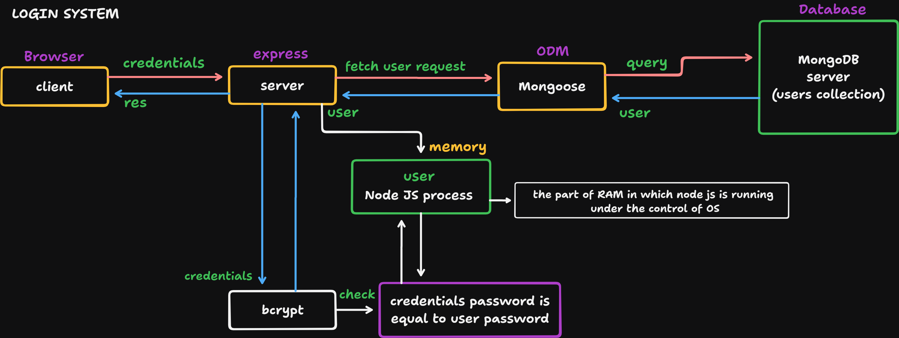
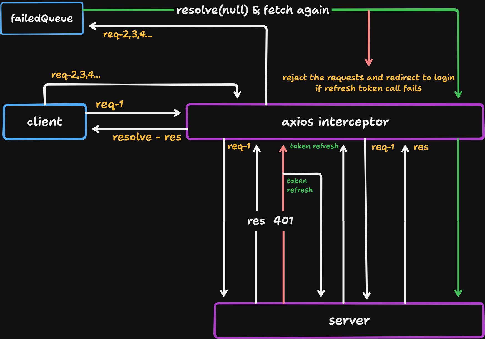

# [WRITTES](https://writtes.com)

### An article writting and sharing web platform with secured authentication

## Table of Contents

- [About](#about)
- [Tech Stack](#tech-stack)
- [Database Design](#database-design)
- [System Architecture](#system-architecture-diagram)
- [Features](#features)
- [Authentication Flow](#authentication-flow)
- [Token Refresh Interceptor](#token-refresh-interceptor-axios)
- [File Upload Pipeline](#file-upload-pipeline-multer--imagekit)
- [Roadmap](#roadmap)

## About

WRITTES is a full-stack blog writing and sharing web platform currently in development with a focus on security and developer-grade architecture. It features a JWT-based token rotation authentication system, cloud-based media management via ImageKit, a rich text editor powered by Lexical which is currently in development, and a MongoDB aggregation-driven post feed.

> Source code is private. This repository documents the architecture, design decisions, and system flows.

## Tech Stack

### Frontend

- React JS
- Redux Toolkit
- Ant Design
- Lexical Rich Text Editor
- Axios
- React Hook Form (RHF)

### Backend

- Express JS
- Bcrypt
- Json Web Token
- Mongoose ODM
- Multer JS
- Resend Mail Service

### Database

- MongoDB Atlas
- ImageKit (File & Media Uploads)

### Deployment

- Docker
- Nginx
- DigitalOcean Droplet

## DataBase Design

### ER - Diagram


### Collections Overview

| Collection     | Purpose                                                     |
| -------------- | ----------------------------------------------------------- |
| `users`        | Stores user credentials, profile, OAuth info, passcode(otp) |
| `posts`        | Blog posts with metadata, slug, and counters                |
| `comments`     | Comments linked to posts and users                          |
| `postLikes`    | Junction collection tracking which user liked which post    |
| `commentLikes` | Junction collection tracking likes on comments              |

### Key Design Decisions

- `postLikes` and `commentLikes` as separate collections — enables efficient querying of "did this user like this post" without scanning embedded arrays, and allows paginated like lists
- Denormalized `likesCount` and `commentsCount` on posts — avoids expensive count queries on every feed load, updated atomically on like/unlike
- `authProvider` as enum — cleanly distinguishes local vs Google OAuth users

## System Architecture Flow



## Features

### Current V-1 Working Features

### Authentication System

- Register & Login with JWT Access & Refresh Token rotation system
- OTP-based email verification on registration
- Forgot Password via OTP email flow
- Google OAuth 2.0 login & registration integration
- Bcrypt password hashing
- Secure httpOnly cookie based token storage

### User Features

- Avatar upload via Multer to ImageKit pipeline
- Profile update — bio, about, social links
- User public profile page (as author)

### Posts & Feed

- Read blog posts uploaded for demo use case
- Like / Unlike posts
- User liked posts list
- Paginated blog post feed with configurable page size in browser URL
- Paginated search results
- Post aggregation with author info & like status in a single DB query

## Authentication Flow

### Registration Flow

#### Control - 1

- User submits essential informations - username, password, email, fullName
- Client validates form data and sends registration request to server
- Server validates & creates a user document in the atlas
- Server generates the one time passcode and saves to the user document
- Server delivers the one time passcode to the registered email for verification
- Server generates JWT `verificationToken` and sends the token to the client (browser cookie)

#### Control - 2

- User submits the verification one time passcode
- Client validates the passcode and sends verification request to server
- Server validates passcode & `verificationToken`
- Server decodes the `verificationToken` and finds the user
- Server validates the one time passcode and its expiry
- Server generates `accessToken` & `refreshToken` and sends the tokens to the client (browser cookie)

### Login Flow

- User submits credentials (username/email + password)
- Client validates the fields and sends a login request to the server
- Server validates the credentials and finds the user from the db
- Server calls the bcrypt password match method
- Bcrypt matches the credential password with the db password
- Server validates the password match & generates `accessToken` & `refreshToken` for login
- Server sends the respones with user tokens to client (browser cookie)

#### Flow Diagram



### Axios Interceptor Flow



```
1. req-1 sent by client → Axios interceptor attaches access token
2. Server responds with 401 (access token expired)
3. Interceptor catches 401 → marks isRefreshing = true
4. Subsequent requests (req-2, req-3...) are pushed to failedQueue
5. Interceptor calls /refresh-token endpoint with refresh token cookie
6. New access token received → failedQueue requests retried
7. All queued requests resolve with the new token
8. Client receives responses as if nothing happened
```
